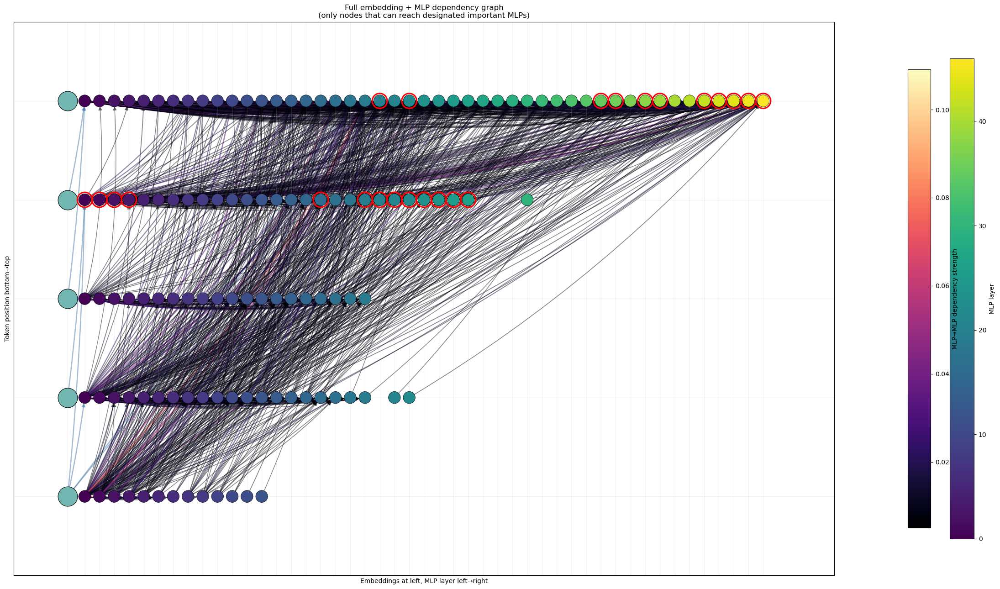
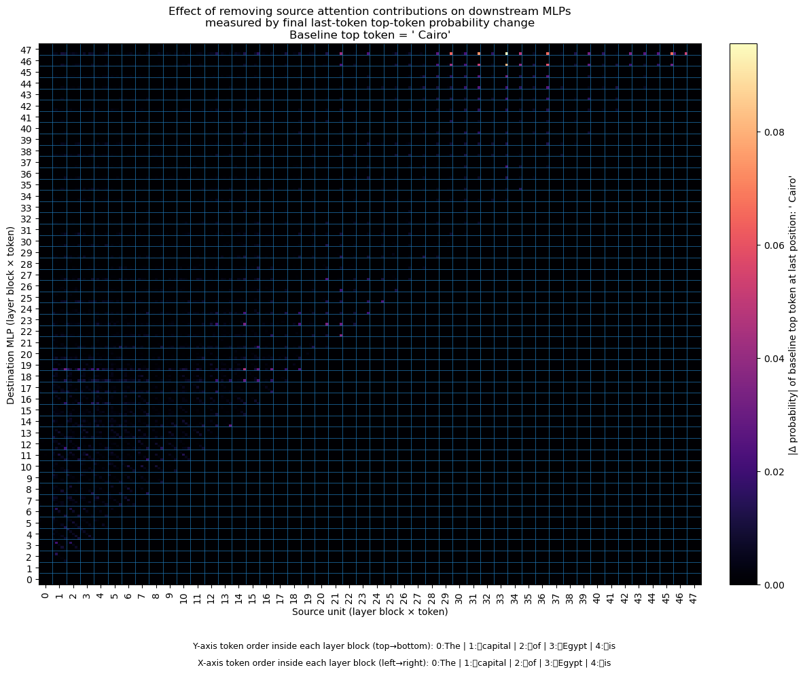
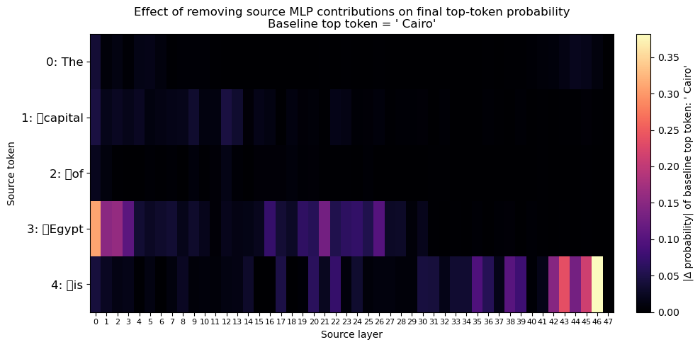
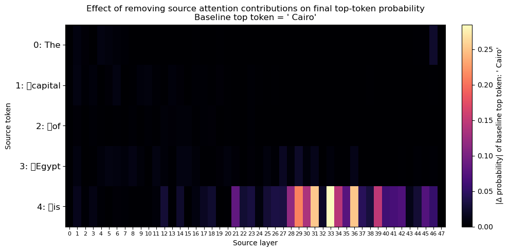
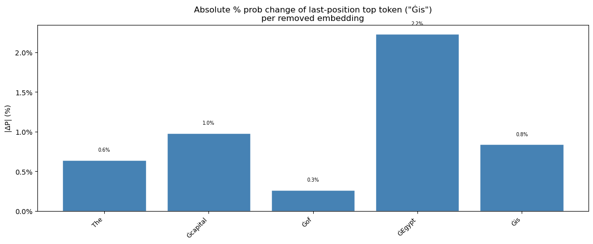
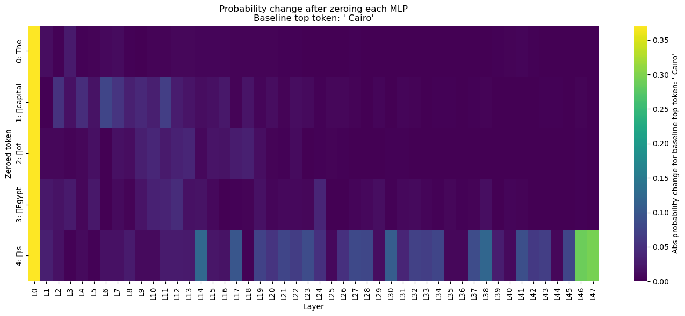
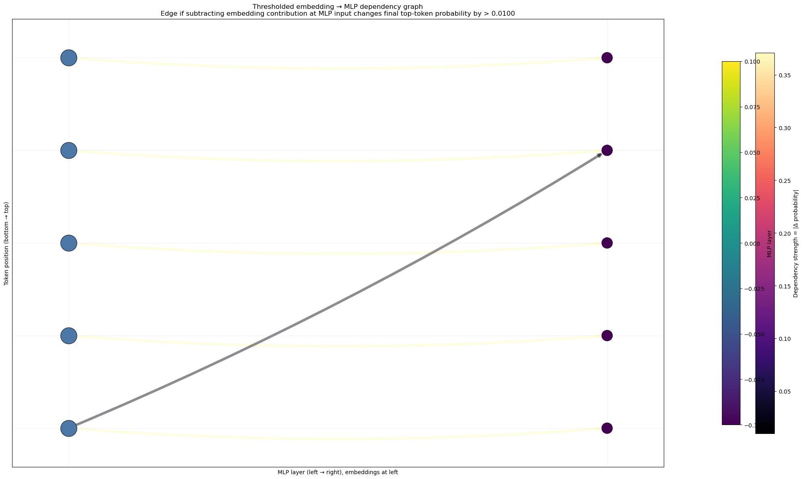
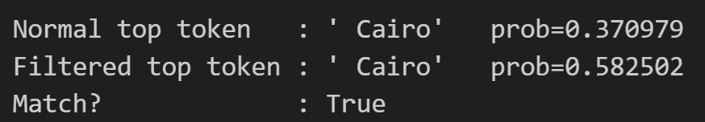
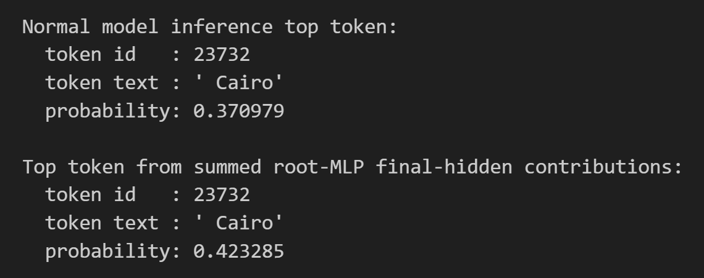

<h1>Dependency Flow Tracing in Transformer Residual Streams</h1>

<h2>Overview</h2>

This repository investigates how token-level information is transported, transformed, and consolidated inside autoregressive transformer models. Rather than treating attention maps or component ablations as isolated diagnostics, the codebase is organized around a stronger mechanistic question: <strong>which internal activations causally support a model’s final prediction, how those activations propagate across layers and tokens, and what dependency structure links embeddings, attention outputs, and MLP computations into a coherent computational pathway</strong>.

The implementation builds a tracing pipeline for GPT-style causal language models that combines activation hooking, frozen-forward intervention, layerwise propagation analysis, and graph extraction. Starting from a source activation—an input embedding, an attention output, or an MLP output—the code estimates how that source is carried forward through the residual stream under the model’s realized attention pattern, then measures how subtracting that propagated contribution changes the probability of the model’s final predicted token. The result is a family of <strong>directed dependency maps</strong> over tokens, layers, and components, together with thresholded circuit-like graphs that summarize the internal pathways most responsible for a given completion.

The current implementation is especially tailored to <strong>factual completion prompts</strong> (for example, country–capital queries), and is designed to expose where factual information is stored, how it is routed forward, and which intermediate components appear necessary or sufficient for the final answer.

<h2>Research Motivation</h2>

A central open problem in mechanistic interpretability is to move beyond surface-level visualizations and toward <strong>causal descriptions of internal computation</strong>. In transformers, information is not represented in a single place: it is repeatedly mixed through residual addition, attention-mediated token interactions, and nonlinear MLP transformations. As a consequence, understanding “where a fact lives” or “which token influences the answer” requires more than examining a single layer or head.

This repository addresses the following broader scientific question:

<blockquote>
  
<strong>How can we recover an explicit dependency structure for transformer computation that links source representations to downstream internal consumers and ultimately to a model’s prediction?</strong>

</blockquote>

This research suggests a view of transformer computation as a <strong>directed flow problem</strong> over the residual stream. Under this view, embeddings and intermediate block outputs inject information into the stream; attention redistributes that information across token positions; downstream MLPs consume and transform it; and the final residual state determines the output logits. The repository operationalizes this idea by tracing source-specific residual contributions forward and testing where they matter.

This makes the project relevant to several interpretability agendas at once:

<ul>
  <li>mechanistic circuit discovery,</li>
  <li>causal attribution beyond gradients,</li>
  <li>cross-layer and cross-token dependency analysis,</li>
  <li>factual recall localization,</li>
  <li>decomposition of prediction-critical pathways into interpretable subgraphs.</li>
</ul>

<h2>Main Contributions</h2>
<ul>
  <li><strong>Residual contribution tracing under realized attention.</strong> The repository propagates source activations forward through later layers using the model’s observed attention pattern, yielding token- and layer-specific estimates of how a source perturbation is redistributed through the network.</li>
  <li><strong>Component-specific causal decomposition.</strong> The implementation distinguishes contributions originating from input embeddings, attention block outputs, and MLP block outputs, and measures their downstream impact separately.</li>
  <li><strong>Destination-conditioned intervention at MLP inputs.</strong> A key feature of the research is the ability to subtract a source’s propagated contribution <em>at a specific downstream MLP input</em> (via <code>ln_2</code> pre-hooks) and measure the resulting change in the final prediction. This produces a directed dependency tensor from source units to downstream MLPs.</li>
  <li><strong>All-to-all dependency tensors over tokens and layers.</strong> The analysis computes high-dimensional effect tensors such as source MLP → destination MLP effects, source attention → destination MLP effects, source embedding → destination MLP effects, and source unit → final logit effects.</li>
  <li><strong>Root-node discovery for prediction-critical internal units.</strong> The code identifies internal MLP states whose removal strongly changes the model’s final prediction, treating them as candidate “important” computational units for the answer.</li>
  <li><strong>Graph extraction from effect tensors.</strong> Thresholded dependency tensors are converted into directed graphs linking embeddings, attention nodes, and MLP nodes, enabling circuit-style visualization of internal computation.</li>
  <li><strong>Upstream ancestry filtering around important units.</strong> The merged embedding+MLP graph is filtered to keep only nodes that can reach designated prediction-critical MLPs, yielding a compact candidate computational subnetwork for the answer.</li>
  <li><strong>Sufficiency-style reconstruction tests.</strong> The repository does not stop at attribution: it tests whether retaining only the graph-supported embeddings and MLP activations is enough to preserve the model’s answer, providing a concrete sanity check on the extracted dependency structure.</li>
  <li><strong>Auxiliary direct vs mediated flow diagnostics.</strong> The code includes diagnostics for full, direct, and semi-direct attention-mediated accumulation, suggesting an interest in separating immediate token-to-token transfer from multi-step mediated propagation.</li>
</ul>

<h2>Core Hypothesis / Research Goal</h2>

The central hypothesis of this project is:

<blockquote>
  
<strong>Prediction-relevant information in a transformer is organized as a sparse, directed dependency structure over embeddings, attention-mediated transfers, and MLP states, and this structure can be recovered by tracing source-specific residual contributions forward and intervening at downstream consumers.</strong>

</blockquote>

Put differently, the repository tests whether a model’s answer can be explained not as a diffuse property of the entire network, but as a <strong>small computational pathway</strong> with identifiable source tokens, important intermediate MLP states, attention-mediated transport steps, and a final residual contribution to the output token.

In the factual-completion setting, the intended scientific goal is:

<ul>
  <li>identify which input tokens seed the relevant information,</li>
  <li>determine which internal MLP states become critical carriers of that information,</li>
  <li>trace how attention redistributes those states across positions and layers,</li>
  <li>recover a dependency graph that explains the answer,</li>
  <li>evaluate whether that graph captures a sufficient subcircuit for the prediction.</li>
</ul>

This positions the project as a mechanistic analysis of <strong>dependency flow in transformer residual computation</strong>, with particular emphasis on how factual information is routed and consolidated into the final prediction.

<h2>Method Overview</h2>

<h3>1. Inputs</h3>

The pipeline takes:

<ul>
  <li>a pretrained autoregressive transformer (default examples use <code>gpt2-xl</code>, with support suggested for <code>gpt-j-6B</code> and <code>gpt-neox-20b</code>),</li>
  <li>a tokenized prompt,</li>
  <li>access to internal weights and activations,</li>
  <li>optionally a dataset of factual prompts (<code>KnownsDataset</code> is imported, though the provided examples use manually specified prompts).</li>
</ul>

<h3>2. Model access assumptions</h3>

The analysis assumes full white-box access to the model:

<ul>
  <li>attention probabilities for each layer,</li>
  <li>residual-stream activations before layer norms,</li>
  <li>attention projection matrices,</li>
  <li>MLP outputs,</li>
  <li>the ability to register forward and pre-forward hooks at embedding dropout, <code>ln_1</code>, <code>ln_2</code>, attention output projections, MLP output projections, and final layer norm input.</li>
</ul>

This is a <strong>mechanistic intervention pipeline</strong>, not a black-box probing method.

<h3>3. Activation capture</h3>

The code records:

<ul>
  <li>pre-attention residual inputs (<code>ln_1</code> inputs),</li>
  <li>pre-MLP residual inputs (<code>ln_2</code> inputs),</li>
  <li>attention block outputs,</li>
  <li>MLP block outputs,</li>
  <li>final hidden state before the LM head,</li>
  <li>embeddings after token+position composition and dropout.</li>
</ul>

These caches serve as the baseline trajectory against which later interventions are defined.

<h3>4. Propagation of source-specific residual contributions</h3>

A central routine (<code>get_full_accum_mat</code> and optimized variants) initializes a source vector at a particular token and layer, then propagates that contribution forward through later layers using:

<ul>
  <li>the realized attention matrices from the baseline run,</li>
  <li>the model’s value and output projection weights,</li>
  <li>an effective layer-normalization scale computed from the cached residual state.</li>
</ul>

Conceptually, the method treats a source activation as a <strong>residual perturbation</strong> and tracks how later attention layers would transport that perturbation across token positions.

<h3>5. Causal measurement via downstream subtraction</h3>

The propagated contribution is then subtracted at one of two key locations:

<ul>
  <li><strong>at a downstream MLP input</strong> (<code>ln_2</code> pre-hook), to test whether a destination MLP depends on that source contribution,</li>
  <li><strong>at the final residual input</strong> (<code>ln_f</code> pre-hook), to test whether the source ultimately matters for the output logits.</li>
</ul>

The main scalar effect used throughout the code is the <strong>absolute change in the baseline top-token probability at the last sequence position</strong>.

<h3>6. Dependency tensor construction</h3>

The code constructs several effect tensors, including:

<ul>
  <li><code>mlp_from_mlp_probdiff[dest_token, dest_layer, src_token, src_layer]</code></li>
  <li><code>mlp_from_atten_probdiff[dest_token, dest_layer, src_token, src_layer]</code></li>
  <li><code>logits_from_mlp_diff[src_token, src_layer]</code></li>
  <li><code>logits_from_atten_diff[src_token, src_layer]</code></li>
  <li><code>emb_to_mlp_probdiff[dest_token, dest_layer, src_embedding_token]</code></li>
</ul>

These tensors define directed edges from upstream sources to downstream internal consumers or to the final output.

<h3>7. Graph extraction</h3>

Thresholding these tensors yields interpretable graphs:

<ul>
  <li>MLP→MLP graphs,</li>
  <li>embedding→MLP graphs,</li>
  <li>root-MLP→attention and attention→attention reachability graphs,</li>
  <li>merged embedding+MLP dependency graphs.</li>
</ul>

<h3>8. Sufficiency tests</h3>

The extracted graph is then used to define a restricted forward pass in which only graph-supported embeddings and graph-supported MLP outputs are retained, while others are zeroed. If the model still predicts the same final token, the graph is treated as evidence for a compact functional subnetwork.

<h3>9. Outputs</h3>

The repository produces:

<ul>
  <li>heatmaps over tokens and layers,</li>
  <li>all-to-all dependency matrices,</li>
  <li>bar charts for token importance,</li>
  <li>directed dependency graphs,</li>
  <li>restricted-model comparisons,</li>
  <li>qualitative case studies on factual prompts.</li>
</ul>

<h2>Repository Structure</h2>

<h3><code>experiments/causal_trace.py</code></h3>

This is the most important imported dependency in the provided code. It appears to provide model/tokenizer loading (<code>ModelAndTokenizer</code>), prompt construction utilities, token-range identification, subject localization, prediction helpers, and causal tracing plotting functions. In the current project, these utilities function as the <strong>instrumentation and model-access layer</strong> on top of which the dependency-flow analysis is built.

<h3><code>util/nethook.py</code></h3>

This module supports model hooking and intervention. It is part of the repository’s low-level machinery for capturing intermediate activations, replacing or zeroing activations, and editing internal module inputs and outputs.

<h3><code>util/globals.py</code></h3>

This module appears to define repository-wide paths and configuration such as <code>DATA_DIR</code>. It supports reproducible access to datasets and cached artifacts.

<h3><code>dsets/</code></h3>

This package includes dataset support, notably <code>KnownsDataset</code>. Its presence strongly suggests that the intended use case is broader than a single prompt and includes <strong>factual knowledge tracing experiments</strong> over curated prompt sets.

<h3><code>scripts/colab_reqs/</code></h3>

This directory contains Colab installation requirements. The notebook-style workflow shown in the code is clearly intended to be runnable in Colab or similarly provisioned GPU environments.

<h3>Core analysis notebook / script</h3>

The main analysis logic in the provided code performs the following tasks:

<ul>
  <li>capture pre-attention and pre-MLP residual states,</li>
  <li>capture per-layer attention and MLP outputs,</li>
  <li>compute effective layer-norm scaling,</li>
  <li>propagate residual contributions through future attention layers,</li>
  <li>intervene at MLP inputs and final residual inputs,</li>
  <li>construct source→destination probability effect tensors,</li>
  <li>discover important internal units,</li>
  <li>extract thresholded dependency graphs,</li>
  <li>test reduced-graph sufficiency.</li>
</ul>

<h2>Conceptual Pipeline</h2>
<ol>
  <li><strong>Load a pretrained causal transformer</strong> with attention outputs enabled.</li>
  <li><strong>Run a baseline prompt</strong> and cache internal residual, attention, embedding, MLP, and final-state activations.</li>
  <li><strong>Select a source activation</strong>: embedding at a token, attention output at a token/layer, or MLP output at a token/layer.</li>
  <li><strong>Propagate that source forward</strong> through later attention layers using frozen baseline attention and effective layer-normalization scaling.</li>
  <li><strong>Intervene on a downstream consumer</strong> by subtracting the propagated contribution at a specific destination MLP input or at the final residual stream before logits.</li>
  <li><strong>Measure the causal effect</strong> as the absolute change in the final top-token probability.</li>
  <li><strong>Repeat across all source–destination pairs</strong> to build dense dependency tensors.</li>
  <li><strong>Threshold and visualize the tensors</strong> as heatmaps and directed graphs.</li>
  <li><strong>Identify important internal units</strong> with strong direct influence on the final prediction.</li>
  <li><strong>Assemble a compact subgraph</strong> of upstream embeddings and downstream MLP dependencies.</li>
  <li><strong>Run a reduced forward pass</strong> retaining only the graph-supported embeddings and MLP outputs.</li>
  <li><strong>Compare full vs reduced predictions</strong> to assess whether the extracted subnetwork plausibly captures the computation of interest.</li>
</ol>

<h2>Interpreting Internal / Dependency Flow in Transformers</h2>

In this repository, “flow” is not merely synonymous with raw attention weights. Instead, it appears to mean:

<blockquote>
  
<strong>the forward transport of source-specific residual information through the model, together with the causal dependence of downstream components on that transported information.</strong>

</blockquote>

<h3>1. Token-to-token transfer through attention</h3>

The code uses realized attention matrices to propagate a source vector across token positions in later layers. This captures where a representation originating at one token is redistributed.

<h3>2. Cross-layer persistence in the residual stream</h3>

Because propagated updates are accumulated additively, the analysis tracks how a source contribution persists across layers rather than disappearing after a single block. The repository therefore studies <strong>residual persistence</strong>, not only instantaneous transfer.

<h3>3. Component-type decomposition</h3>

The project distinguishes three kinds of computational sources:

<ul>
  <li><strong>embeddings</strong>, representing initial token-level inputs,</li>
  <li><strong>attention outputs</strong>, representing transported or mixed information,</li>
  <li><strong>MLP outputs</strong>, representing transformed features or facts written into the residual stream.</li>
</ul>

This supports a richer interpretation of internal flow than head-level attention alone.

<h3>4. Consumer-centric dependency</h3>

A downstream component is considered dependent on a source when subtracting the source’s propagated contribution at that component’s input changes the final prediction. This turns flow into a <strong>causal consumption relation</strong>, not just a co-occurrence pattern.

<h3>5. Path structure and circuit discovery</h3>

By thresholding source→destination effect tensors, the code constructs directed graphs that approximate latent computational pathways, such as embedding → MLP, MLP → MLP, root MLP → attention consumer, and attention → attention. These graphs are a practical representation of <strong>candidate internal circuits</strong>.

<h3>6. Direct versus mediated transfer</h3>

The presence of full, direct, and semi-direct accumulation utilities suggests that the repository is also interested in whether a source reaches a target directly, via a small set of mediator tokens, or through broader distributed propagation.

<h3>7. Final prediction anchoring</h3>

All dependency measurements are grounded in their effect on the final next-token prediction. This makes the extracted flow operationally meaningful: it is the portion of internal transport that matters for what the model actually says.

<h2>Expected Figures and Plots</h2>

<h3>Figure 1. End-to-End Dependency Flow Tracing Pipeline</h3>

A schematic overview of the method: embeddings, attention blocks, MLP blocks, propagated residual contributions, downstream subtraction, and graph extraction.

<h3>Figure 2. Source MLP → Destination MLP Dependency Heatmap</h3>

A dense all-to-all heatmap where rows index destination MLPs (token × layer), columns index source MLP outputs (token × layer), and color indicates the absolute change in final top-token probability after subtracting the source’s propagated contribution at the destination MLP input.

Interpretation: bright regions indicate downstream MLPs that critically depend on specific upstream MLP states.

<h3>Figure 3. Source Attention → Destination MLP Dependency Heatmap</h3>

An all-to-all dependency map from source attention outputs to downstream MLP inputs, measured by the resulting change in the final top-token probability.

Interpretation: this figure highlights where attention-mediated states, rather than MLP-written states, are consumed by later MLPs.

<h3>Figure 4. Final Prediction Sensitivity to Source MLP Outputs</h3>

A token × layer heatmap showing how much the final top-token probability changes when the propagated contribution of each source MLP is removed from the final residual stream.

Interpretation: this identifies prediction-critical MLP states.

<h3>Figure 5. Final Prediction Sensitivity to Source Attention Outputs</h3>

A token × layer heatmap analogous to Figure 4, but for attention outputs.

Interpretation: useful for distinguishing whether the answer is primarily supported by transformed MLP content or by attention-mediated transport states.

<h3>Figure 6. Last-Token Probability Change per Removed Input Embedding</h3>

A bar chart measuring how much the final top-token probability changes when the propagated contribution of each input embedding is removed.

Interpretation: this gives a prompt-level view of which input tokens seed the answer-relevant computation.

<h3>Figure 7. Single-MLP Zeroing Heatmap</h3>

A token × layer heatmap obtained by zeroing each individual MLP output directly and measuring the resulting final probability change.

Interpretation: this is a simpler ablation baseline against which propagated dependency analysis can be compared.

<h3>Figure 8. Root-MLP Reachability Graph Through Attention Consumers</h3>

A directed graph rooted at important MLPs whose outgoing effects are traced through attention consumers and later attention nodes.

Interpretation: this figure is useful for understanding where prediction-critical MLP content is routed after it is written into the residual stream.

<h3>Figure 9. Thresholded MLP Dependency Graph</h3>

A directed graph over MLP nodes where an edge indicates that a destination MLP measurably depends on an upstream source MLP.

Interpretation: this is a circuit-like representation of cross-layer MLP dependency structure.

<h3>Figure 10. Embedding → MLP Dependency Heatmap</h3>

A heatmap with source embeddings on one axis and destination MLPs on the other, where color reflects the downstream effect of subtracting the propagated embedding contribution at the destination MLP input.

Interpretation: this reveals which MLP states consume information seeded by particular input tokens.

<h3>Figure 11. Maximum Dependency Strength per Source Embedding</h3>

A summary bar chart showing, for each source embedding token, the maximum downstream embedding→MLP dependency strength across all destination MLPs.

Interpretation: this highlights the most globally influential source tokens.

<h3>Figure 12. Thresholded Embedding → MLP Graph</h3>

A bipartite directed graph connecting source embedding tokens to downstream MLP nodes when the measured dependency exceeds a threshold.

Interpretation: this makes explicit which MLP computations appear to consume information from which prompt tokens.

<h3>Figure 13. Merged Embedding+MLP Dependency Graph Anchored on Important MLPs</h3>

A merged graph containing embedding→MLP and MLP→MLP edges, filtered to retain only nodes that can reach designated important MLPs.

Interpretation: this is the repository’s most direct candidate circuit diagram for the final prediction.

<h3>Figure 14. Prediction Reconstruction from the Extracted Subgraph</h3>

A comparison between full-model inference and restricted inference that keeps only the embeddings and MLP nodes retained by the extracted graph.

Interpretation: if the prediction is preserved, the extracted graph is a strong candidate explanation of the answer pathway.

<h3>Figure 15. Root-MLP Contribution Reconstruction at the Final Hidden State</h3>

A figure or table comparing the model’s normal top prediction against the prediction induced by summing only the final-hidden contributions of identified root MLPs.

Interpretation: this tests whether a small set of important MLP states accounts for the decisive geometry at the final prediction site.

<h2>Experimental Setup</h2>

<h3>Models</h3>

The default model is:

<ul>
  <li><code>gpt2-xl</code></li>
</ul>

The code also explicitly mentions support for:

<ul>
  <li><code>EleutherAI/gpt-j-6B</code></li>
  <li><code>EleutherAI/gpt-neox-20b</code></li>
</ul>

The model is loaded with:

<ul>
  <li><code>output_attentions=True</code>,</li>
  <li>eager attention implementation,</li>
  <li>optional reduced-memory loading for Colab,</li>
  <li>optional mixed precision for larger models.</li>
</ul>

<h3>Prompt regime</h3>

The examples shown are short factual or semantic prompts such as:

<ul>
  <li>“The capital of Egypt is”</li>
  <li>“The capital of Iran is”</li>
  <li>“Egypt is in the continent of”</li>
</ul>

This strongly suggests that the primary experimental regime is <strong>next-token factual completion</strong>.

<h3>Data support</h3>

<code>KnownsDataset</code> is imported, indicating that the project likely aims to scale beyond handcrafted prompts to a dataset of known facts or factual prompts.

<h3>Units of analysis</h3>

The code studies dependencies among:

<ul>
  <li>input embeddings at token positions,</li>
  <li>attention outputs at token-layer locations,</li>
  <li>MLP outputs at token-layer locations,</li>
  <li>final residual contributions to the last-token logits.</li>
</ul>

<h3>Effect metric</h3>

The main effect metric is the <strong>absolute change in the probability of the baseline top token at the last sequence position</strong>.

<h3>Intervention locations</h3>

The code intervenes at:

<ul>
  <li>embedding output after token+position composition,</li>
  <li>MLP output projections,</li>
  <li>attention output projections,</li>
  <li><code>ln_2</code> inputs for destination-MLP dependency tests,</li>
  <li><code>ln_f</code> input for final-residual dependency tests.</li>
</ul>

<h3>Analysis settings</h3>

Important thresholds are configurable and appear in the code at values such as:

<ul>
  <li>root-node threshold around <code>0.04–0.10</code>,</li>
  <li>graph threshold around <code>0.005–0.01</code>.</li>
</ul>

These are analysis hyperparameters rather than fixed model properties.

<h3>Runtime profile</h3>

The method is computationally intensive because it performs large numbers of hooked forward passes over token/layer combinations. GPU execution is effectively assumed for larger models and broader sweeps.

<h2>Key Findings / What This Research Enables</h2>
<ul>
  <li><strong>Localization of answer-critical internal states.</strong> It can identify which token-layer MLP states most strongly support a prediction.</li>
  <li><strong>Disentangling stored content from transported content.</strong> By separating MLP-origin and attention-origin effects, the code helps distinguish where information is written versus where it is routed.</li>
  <li><strong>Mapping which prompt tokens feed which internal computations.</strong> Embedding→MLP dependencies expose which downstream computations appear to consume information seeded by specific input tokens.</li>
  <li><strong>Recovering cross-layer computational chains.</strong> MLP→MLP dependencies provide a candidate graph of how information is transformed across layers.</li>
  <li><strong>Extracting compact candidate circuits.</strong> The merged filtered graph offers a principled way to summarize the minimal subnetwork plausibly responsible for a prediction.</li>
  <li><strong>Testing sufficiency of the extracted subnetwork.</strong> The reduced-model forward pass moves the analysis from “importance” toward “explanatory adequacy.”</li>
  <li><strong>Studying factual recall mechanistically.</strong> In knowledge prompts, the method can help analyze whether a fact is carried primarily by early token embeddings, mid-layer MLP states, or later integration steps.</li>
</ul>

<h2>Limitations and Scope</h2>
<ul>
  <li><strong>Frozen-attention propagation.</strong> The source-propagation routines use the baseline attention pattern rather than recomputing attention under each intervention. This makes the propagation estimate locally faithful to the realized run, but not a full nonlinear counterfactual simulation.</li>
  <li><strong>Layer-norm linearization.</strong> The use of effective layer-normalization scaling is a principled approximation, but still an approximation.</li>
  <li><strong>Prediction-conditioned analysis.</strong> Effects are anchored to the baseline top token at the final position. The method therefore explains a specific prediction, not the model’s entire output distribution in a symmetric way.</li>
  <li><strong>Single-prompt granularity in the provided workflow.</strong> The code is structured around detailed per-prompt case studies. Broader statistical conclusions require running the same analysis across many prompts.</li>
  <li><strong>Partial component coverage.</strong> The main graph extraction focuses on embeddings, attention outputs, and MLP outputs. It does not yet provide a full head-level, neuron-level, or residual-basis decomposition.</li>
  <li><strong>Threshold sensitivity.</strong> The extracted graphs depend on user-chosen thresholds. These graphs should be viewed as candidate mechanistic summaries rather than unique ground truth circuits.</li>
  <li><strong>Model family assumptions.</strong> The implementation is tailored to GPT-style decoder-only transformers with accessible internals and known module naming conventions.</li>
</ul>

<h2>Getting Started</h2>

<h3>Installation</h3>

Clone the repository and install the provided requirements:

<pre><code>git clone &lt;repo-url&gt;
cd &lt;repo-name&gt;
pip install -r scripts/colab_reqs/rome.txt</code></pre>

For Colab-style environments, the code also upgrades Google Cloud Storage support:

<pre><code>pip install --upgrade google-cloud-storage</code></pre>

<h3>Environment</h3>

Run the analysis from the repository root so that <code>util/</code> and <code>experiments/</code> are importable:

<pre><code>import os, sys
REPO = "/path/to/repo"
os.chdir(REPO)
if REPO not in sys.path:
    sys.path.insert(0, REPO)</code></pre>

<h3>Basic usage</h3>

A typical workflow is:

<ol>
  <li>load a model with attention outputs enabled,</li>
  <li>choose a prompt,</li>
  <li>cache residual, attention, MLP, and embedding activations,</li>
  <li>compute source→destination dependency tensors,</li>
  <li>plot heatmaps and graphs,</li>
  <li>run restricted-inference sufficiency checks.</li>
</ol>

A minimal example follows the pattern below:

<pre><code>from transformers import AutoTokenizer, AutoModelForCausalLM, AutoConfig
from experiments.causal_trace import ModelAndTokenizer

model_name = "gpt2-xl"
config = AutoConfig.from_pretrained(model_name)
config.attn_implementation = "eager"
config.output_attentions = True

mt = ModelAndTokenizer(model_name)
mt.tokenizer = AutoTokenizer.from_pretrained(model_name)
mt.model = AutoModelForCausalLM.from_pretrained(model_name, config=config)

input_string = "The capital of Egypt is"
input_ids = mt.tokenizer.encode(input_string, return_tensors="pt").to(mt.model.device)</code></pre>

From there, the core analysis consists of:

<ul>
  <li>capturing per-layer residual/MLP/attention states,</li>
  <li>running propagation routines such as <code>get_full_accum_mat(...)</code>,</li>
  <li>computing tensors such as <code>mlp_from_mlp_probdiff</code>, <code>mlp_from_atten_probdiff</code>, <code>logits_from_mlp_diff</code>, and <code>emb_to_mlp_probdiff</code>,</li>
  <li>plotting the resulting heatmaps and graphs.</li>
</ul>

<h3>Recommended workflow</h3>

For first use, start with:

<ul>
  <li><code>gpt2-xl</code>,</li>
  <li>a short factual prompt,</li>
  <li>a small sequence length,</li>
  <li>moderate graph thresholds (<code>0.005–0.01</code>),</li>
  <li>one case-study prompt before scaling to a dataset.</li>
</ul>

<h2>Reproducibility</h2>

To reproduce the main analyses:

<ol>
  <li><strong>Run from the repository root</strong> so internal imports resolve correctly.</li>
  <li><strong>Use a model with accessible attentions</strong> and set <code>output_attentions=True</code>.</li>
  <li><strong>Cache baseline activations</strong> for the prompt of interest:
    <ul>
      <li><code>ln_1</code> inputs,</li>
      <li><code>ln_2</code> inputs,</li>
      <li>attention outputs,</li>
      <li>MLP outputs,</li>
      <li>final hidden state,</li>
      <li>embeddings.</li>
    </ul>
  </li>
  <li><strong>Compute dependency tensors</strong>:
    <ul>
      <li>source MLP → destination MLP,</li>
      <li>source attention → destination MLP,</li>
      <li>source embedding → destination MLP,</li>
      <li>source unit → final prediction.</li>
    </ul>
  </li>
  <li><strong>Apply graph thresholds</strong> consistently and record them in output filenames or configs.</li>
  <li><strong>Save all plots and graph summaries</strong> per prompt and per model.</li>
  <li><strong>Run the restricted-inference sanity check</strong> using the graph-supported embeddings and MLP outputs.</li>
  <li><strong>For dataset-level experiments</strong>, iterate over prompts from <code>KnownsDataset</code> and aggregate:
    <ul>
      <li>number of important MLPs,</li>
      <li>graph size,</li>
      <li>top-token preservation rate under restricted inference,</li>
      <li>cross-prompt stability of discovered pathways.</li>
    </ul>
  </li>
</ol>

For rigorous reporting, it is advisable to log:

<ul>
  <li>model name and revision,</li>
  <li>exact prompt text and tokenization,</li>
  <li>thresholds for graph construction,</li>
  <li>whether the effect metric is probability- or logit-based,</li>
  <li>runtime device and precision,</li>
  <li>random seeds when batching or dataset sampling is involved.</li>
</ul>

<h2>Citation</h2>
<pre><code>@misc{dependency_flow_tracing_2026,
  title        = {Dependency Flow Tracing in Transformer Residual Streams},
  author       = {Author(s) Placeholder},
  year         = {2026},
  howpublished = {\url{https://github.com/your-org/your-repo}},
  note         = {Research code for causal dependency analysis of embeddings, attention outputs, and MLP states in autoregressive transformers}
}</code></pre>

<h2>Acknowledgments</h2>

This repository builds on hook-based causal tracing and transformer interpretability tooling in the broader mechanistic interpretability ecosystem. The current implementation appears especially indebted to the causal tracing infrastructure used in the ROME codebase, while extending that style of analysis toward explicit dependency-flow and circuit extraction.

